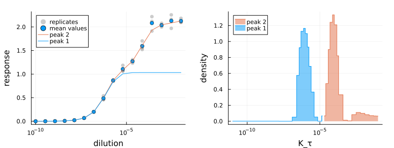

# AntibodyMethodsDoseResponseConvenience.jl

[](https://antibodypackages.github.io/AntibodyMethodsDoseResponse-documentation/)

A [Julia](https://julialang.org/) package for the analysis of dose-response curves with [`AntibodyMethodsDoseResponse.jl`](https://github.com/AntibodyPackages/AntibodyMethodsDoseResponse.jl). Contains predefined analysis and plotting methods. Recommended for most users.




## Installation

The package can be installed with the following commands

```julia
using Pkg
Pkg.Registry.add()
Pkg.Registry.add(RegistrySpec(url = "https://github.com/AntibodyPackages/AntibodyPackagesRegistry"))
Pkg.add("AntibodyMethodsDoseResponseConvenience")
```
Since the package is not part of the `General` registry the commands install the additional registry `AntibodyPackagesRegistry` first.

After the installation, the package can be used like any other package:
```julia
using AntibodyMethodsDoseResponseConvenience
```

## Resources

* **Documentation:** [https://antibodypackages.github.io/AntibodyMethodsDoseResponse-documentation/](https://antibodypackages.github.io/AntibodyMethodsDoseResponse-documentation/)
* **Corresponding paper:** [https://arxiv.org/abs/2407.06052](https://arxiv.org/abs/2407.06052)


